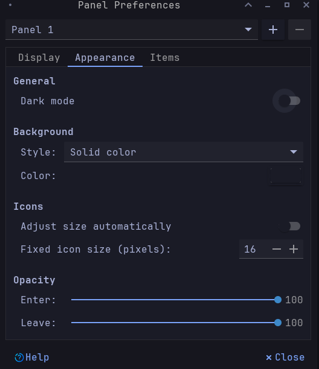
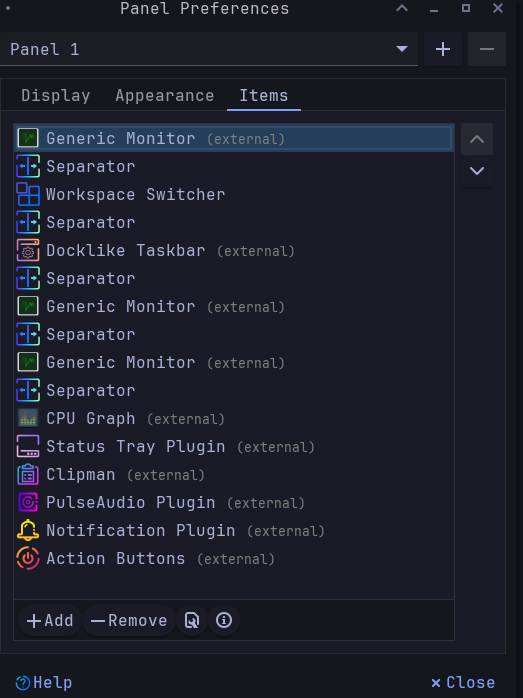

<!-- HEADERS -->
<p align="center">
  
</p>

<p align="center">
  <b> ~ My personal dotfiles with XFCE and Tokyo Night ~ </b>
</p>


<p align="center">
<a href="https://github.com/jrona1do/tokyofiles/network/members">
    &nbsp;&nbsp;&nbsp;


<a href="https://github.com/jrona1do/tokyofiles/stargazers/">
    &nbsp;&nbsp;&nbsp;

</p>


<!-- INFORMATION -->

### Thanks for dropping by!


Welcome a my personal collection of configuration files.


If you are interested in my **[XFCE] - Everything Tokyo Night**, follow the setup below:

- **WM:** [xfwm](https://wiki.archlinux.org/title/Xfwm)
- **DE:** [xfce](https://wiki.archlinux.org/title/Xfce)
- **OS:** [Arch Linux](https://archlinux.org)
- **Terminal:** [kitty](https://github.com/kovidgoyal/kitty)
- **Terminal multiplexer:** [tmux](https://github.com/tmux/tmux/wiki)
- **Shell:** [zsh](https://wiki.archlinux.org/index.php/Zsh)
- **Monitor of resources:** [btop](https://github.com/aristocratos/btop)
- **GTK theme:** [TokyoNight](https://github.com/stronk-dev/Tokyo-Night-Linux/tree/master/usr/share/themes/TokyoNight)
- **Widgets:** [eww](https://github.com/elkowar/eww)
- **Compositor:** [picom](https://github.com/ibhagwan/picom)
- **Editor:** [neovim (NvChad)](https://github.com/NvChad/NvChad)
- **Browser:** [firefox](https://www.mozilla.org/en-US/firefox)
- **Startpage:** [YAGS](https://github.com/PrettyCoffee/yet-another-generic-startpage)
- **File Manager:** [thunar](https://github.com/xfce-mirror/thunar)
- **Application Launcher:** [rofi](https://github.com/davatorium/rofi)
- **Wallpaper:** [by Leikoi](https://alphacoders.com/author/view/62160)
---

The [setup section](#setup) will guide you through the installation process.

## Setup
> This is step-by-step of this setup is divided into:

- [Dependencies](#dependencies)
- [Panel Preferences](#panel)
- [Fonts](#fonts)
- [Elkowar's Wacky Widgets(Eww)](#eww)
- [Installation](#installation)
---
## Dependencies

<details open>
   <summary><strong>Arch Linux (and Arch-based distributions)</strong></summary>

> Assuming your **AUR Helper** is [yay](https://github.com/Jguer/yay), and have **group** [xfce4](https://archlinux.org/groups/x86_64/xfce4/) installed


```sh
 $ yay -S xfce4-genmon-plugin xfce4-docklike-plugin xfce4-cpugraph-plugin \ 
 xfce4-clipman-plugin xfce4-pulseaudio-plugin \
 vim nvim nvim-packer-git kitty tmux zsh rofi spotify \ 
 picom-ibhagwan-git playerctl xclip btop stow \

```

   </details>

   <br>

## Panel

> Panel preferences match a **1920x1080** resolution monitor.






<details open>
   <summary><strong>Separator</strong></summary>

   - All separators have ***transparent style***, where 3rd and 4th are ***expanded***.

<details open>
   <summary><strong>Generic Monitor</strong></summary>

   - Generic Monitor matches [Genmon](https://docs.xfce.org/panel-plugins/xfce4-genmon-plugin/start), in this repository, they can be found [here](https://github.com/jrona1do/tokyofiles/tree/master/genmom-scripts/.config/genmom-scripts).


<details open>
   <summary><strong>Panel Style</strong></summary>

   - Panel styling is able to change the colors of panel components such as [workspace switcher](https://docs.xfce.org/xfce/xfce4-panel/pager), [plugins](https://docs.xfce.org/xfce/xfce4-panel/start#external_plugins) and [action buttons](https://docs.xfce.org/xfce/xfce4-panel/actions). For more details, [visit](https://docs.xfce.org/xfce/xfce4-panel/start).

In this repository, they can be found [here](https://github.com/jrona1do/tokyofiles/tree/master/gtk-3.0/.config/gtk-3.0)


## Fonts
> You will need to install the following fonts
- [DaddyTimeMono Nerd Font](https://github.com/ryanoasis/nerd-fonts/releases/download/v2.3.3/DaddyTimeMono.zip)
- [JetBrainsMono Nerd Font](https://github.com/ryanoasis/nerd-fonts/releases/download/v2.3.3/JetBrainsMono.zip)
- [Font Awesome 6](https://use.fontawesome.com/releases/v6.3.0/fontawesome-free-6.3.0-desktop.zip)

> After installing the fonts, run.

```sh
fc-cache -fv
```

## Eww
> The widgets shown [here](https://github.com/jrona1do/tokyofiles/tree/master/eww/.config/eww) are for a monitor with a resolution of 1920x1080. If you have another type of resolution, you must change the values `x` and `y`.
 - Follow the [installation instructions](https://elkowar.github.io/eww/) and run.

```sh
cd target/release
chmod +x ./eww
mv eww $HOME/.local/bin/
```


